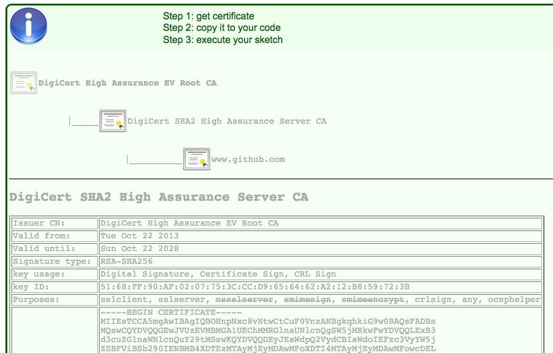

# ESP32FOTA   
ESP32 SSL httpUpdate at https://raw.githubusercontent.com/   
An simple Arduino project for updating ESP32 firmware where kept at GitHub.

  

A successful updating message log for binary at https://raw.githubusercontent.com  
 &nbsp;&nbsp;&nbsp; 
  

Use this link to get correct root SSL certification:
      https://projects.petrucci.ch/esp32/?page=ssl
 

  

## References
  - [Arduino httpUpdate Library](https://github.com/espressif/arduino-esp32/tree/master/libraries/Update) Arduino ESP32 httpUpdate library at Github.
  - [SSL root CA converter](https://projects.petrucci.ch/esp32/?page=ssl) Get SSL root certification converted for ESP32.

